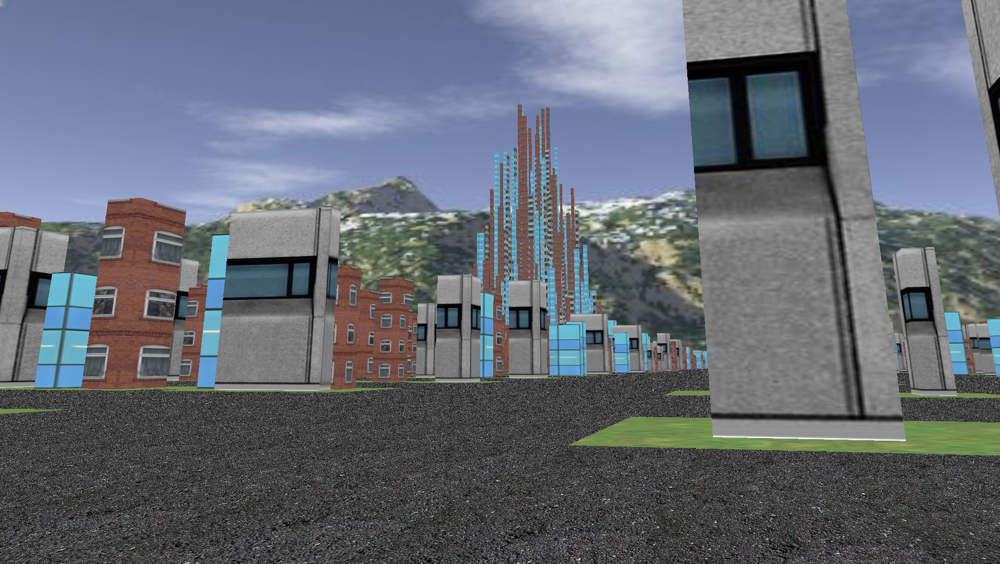
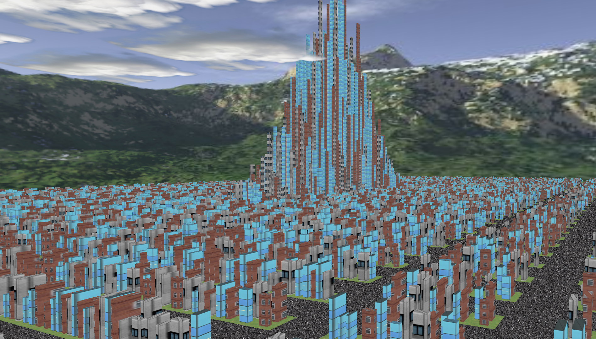

# City Procedural Generator

I made a city procedural generator on c++ with openGl. Every aspect of the city is generated randomly (Size, streets, Textures) so yeah... Sometimes it's feel a little bit unreal :) . The size of the city is arround 500 to 30 000 buildings (depends the number of rows and cols).

# Libraries
-GLM
-SOIL
-OpenGl

#Configuration
We can set the Scale of the city (I prefer 700). More the scale is higher, bigger the city is.
We can set the number of the random for the row and the cols (don't go higher than 30).
We can set the number of streets (how many buildings before new street is created)(I set it randomly between 20).

## Camera
I use a projection camera with basics controls :

|Control|Action |
|--|--|
|  w|  Move foward|
|  s|  Move backward|
|  a|  Move left|
|  d|  Move right|
|  x|  Go down|
|  z|  Go up|
|  r|  Recreate a new city|

## Gaussian function
I use gaussian function to set height of my buildings. Basically, better are the chance that buldings are higher in the center.

## Showcase

